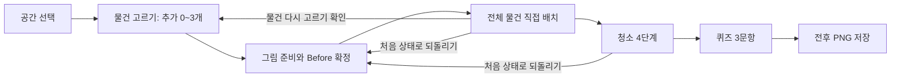

# 구현 계획: 정리 정돈과 청소를 실천해요

버전 2.1 · 2026-09-16 · **구현·검수 진행 중. 실제 완료 범위는 TASKS.md에 기록한다.**

## A. 실행 조건과 우선순위

사용자가 ‘수업 완성도 우선, 일정 재산정’을 선택했다. 기존 1~2일 일정 대신 **아트부터 검수까지 98~148인시**로 계획한다. 가장 먼저 실제 책상에서 이동·청소·PNG 저장을 확인한 뒤 추가 선택과 다른 가구 구조를 검증한다. 모든 최종 기능은 필수이며 Phase는 작업 순서를 나눈 것이다.

사용자의 ‘구현을 시작해’ 지시로 착수했다. 내부 통과 기준마다 재승인을 요구하지 않는다. 코드 작성 승인이 배포·commit·push·저장소 공개 변경 승인은 아니다. 최신 배치 기준은 AGENTS.md와 PLACEMENT_REVIEW.md를 함께 따른다.

| 고정값 | 결정 |
|---|---|
| 프레임워크 | React+TypeScript+Vite, react-konva/Konva |
| 상태·스타일 | App의 useReducer, 순수 도메인 규칙, 전역 CSS 토큰. 맵별 화면 복제 없음 |
| 공간·물건 | 9개 맵, 물건 72종, 맵별 기본 8·추가후보 6·선택 0~3 |
| 활동 | 확정한8~11개를 자유 배치→청소→3문항→PNG |
| 장면·출력 | 논리960×720, 렌더DPR≤2, 출력DPR1, PNG1984×848 |
| 초기 배치 | 맵별 기본 위치8+추가 위치3. 무작위 없음 |
| 보관·청소 | 맵별 보관4+치우기1, 먼지4. 실제 지지면·물건 경계·접점·충돌 검사 |
| 저장 | v2 단일 활동, 2시간 만료, 목표 20KB 이하 |
| 파일 | 이미지 121개, 전체 이미지 목표 6019KB·상한 9535KB, dist 목표 12MB |

## B. 사용자 흐름과 상태 전이

**랜딩→이름/캐릭터→튜토리얼→공간 선택→물건 고르기→정리 정돈→청소→퀴즈→결과 이미지→종료**

물건 고르기는 맵 진입 준비 화면이다. 기본 8개가 보이는 장면과 후보 6카드를 함께 보여 준다. 고른 물건은 추가 대기 위치에 나타난다. 아직 드래그·회전은 하지 않는다. ‘이 물건으로 정리 시작’이 현재 세트를 확정한다.

| 상태 | 가능한 입력 | 다음 상태·조건 | 보존·초기화 |
|---|---|---|---|
| landing | 활동 시작 / 이어하기 / 처음부터 | profile 또는 검증된 저장 단계 | 이어하기 선택 전에 이전 이름 노출 금지 |
| profile | 이름·캐릭터 선택, 다음 | 유효 입력이면 tutorial | IME 조합 중 제출 금지 |
| tutorial | 상황 카드 분류 | 4개 완료 후 map-selection | 새로고침은 카드 처음부터 |
| map-selection | 9개 중 공간 선택 | item-selection | 새 mapSessionId, 이전 물건·캡처 비움 |
| item-selection | 추가 카드 토글, 정리 시작, 공간 변경 | 추가 0~3 유효+필수 decode+Before 성공이면 organizing | draftExtraIds 저장. 확정 전 transforms/Before 없음 |
| organizing | 이동·회전·탭 놓기, 확인, 다시 고르기, 초기화 | 모든 활성 개체 유효하면 cleaning | Before 불변, 완료 판정은8~11개 전부 |
| cleaning | 현재 단계 도구·지점, 초기화, 다른 공간 | 환기→가구먼지→쓸기→닦기→도구정리 후 quiz | 물건 이동·회전·추가 잠금, After 생성 |
| quiz | 보기 선택·다음, 초기화 | 3개 설명 확인 후 result | 답은 저장하지 않음. 새로고침은 Q1 |
| result | PNG 만들기·저장·크게 보기·끝내기·초기화 | 끝내기 확인 후 ended | 결과 생성 실패는 데이터 보존·재시도 |
| ended | 새 활동 시작 | profile | 이름·선택·진행·앱 키·Blob 해제 |

로딩·캡처·오류는 화면 안의 부상태다. 배경 준비 실패로 URL이나 새로운 화면 경로를 만들지 않는다.

### 서로 다른 세 가지 되돌리기

| 행동 | 제공 위치 | 확인 후 결과 |
|---|---|---|
| 처음 상태로 되돌리기 | 정리·청소·퀴즈·결과 | 이름·캐릭터·맵·확정 추가세트 유지. 위치·청소·퀴즈·캡처만 초기화 |
| 물건 다시 고르기 | 정리 | 현재 추가세트를 초안으로 옮기고 선택 화면으로. 진행·Before/After 폐기 |
| 다른 공간 선택 | 선택·정리·청소 | 프로필·튜토리얼 완료 유지. 현재맵·추가선택·진행·캡처 폐기 |

선택 화면에서 공간을 바꿀 때는 아직 정리한 진행이 없으므로 별도 초기화 경고를 띄우지 않는다. 진행 중 변경과 초기화의 확인 취소는 **아무것도 지우지 않는다**. 청소 이후 물건 구성을 바꾸려면 먼저 초기화해 정리로 돌아간다.

## C. 예상 컴포넌트와 책임

| 책임 | 예상 단위 | 경계 |
|---|---|---|
| 앱·프로필·복원 | App, ActivityProvider, ProfileScreen, ResumePrompt | 화면 전이, IME 입력, 이전 이름 비노출 |
| 튜토리얼·공간 | TutorialScreen, MapSelectScreen | 문구 상수·정적 메타데이터 |
| 물건 선택 | ItemSelectionScreen, ExtraItemPicker | 현재맵6카드·초안0~3·미리보기 |
| 공통 장면 | Scene, BackgroundLayer, ItemLayer, OverlayLayer | 실활동·선택 미리보기·출력 공용 |
| 조작·목록 | ObjectList, ItemControls, useSceneInput | 드래그·탭 놓기·회전·재선택 |
| 순수 규칙 | deriveActiveItems, isPlacementValid, deriveCleaningStep | DOM/Konva 없이 검사 |
| 청소·퀴즈 | CleaningPanel, QuizScreen | 순서 잠금·3문항 |
| 출력 | captureScene, composeResult, ResultScreen | Stage·Canvas2D·Blob 수명 |
| 저장·자산 | storageValidator, assetLoader | 단계별 검증·decode·세션 guard |

맵마다 새 React 컴포넌트를 만들지 않는다. 책상·수납장·도서관의 차이는 데이터로 표현한다. 재사용을 이유로 가구를 같은 형태로 바꾸지 않는다.

## D. 데이터 모델

| 모델 | 필드·규약 |
|---|---|
| AssetDefinition | id, path, label, artSize, displayWidth/Height, rotatable, purpose. 72종은 공용 카탈로그 |
| MapDefinition | id, revision, name, category, family, description, focus, background, thumbnail, fixedFurniture, baseItems[8], extraOptions[6], extraInitialSlots[3], zones[5], dirt[4] |
| MapItemDefinition | instanceKey(b1~b8 또는 e1~e6), assetId, label, allowedZoneIds, kind(store/discard), 선택적 purposeOverride, baseInitialTransform(기본 개체만) |
| TargetZone / Surface | 장소 ID와 실제 지지 다각형, 입구·안쪽 면, 자세·접점·가림 면·고정 장애물. 계획용 rects는 아트 제작 가이드 |
| DirtSpot | id, label, assetId, center, width/height, step, requiredTool |
| Session | schemaVersion=2, contentVersion, step, name, character, tutorialDone, mapId/mapRevision, extras, placements, ventilated, cleaned, toolsStored, sessionId, revision, updatedAt |
| TransientState | loadStatus, captureStatus, selectedItemId, activeTool, pointer state, error, pending confirmation. 저장하지 않음 |
| ResultSnapshot | mapId/revision, selectedExtraIds, initialSceneData, finalSceneData, capturedSceneRevision. 초기/최종/합성 Blob은 메모리만 |
| PersistedActivity | Session의 검증된 데이터. extras는 setup에서 초안, organize 이후 확정 세트. placements의 surface/x/y/angle/stackOn을 저장하며 그리기 순서는 계산 |
| Profile / Cleaning | displayName·characterId / ventilated·removedDirtIds·toolsStored |

정적 데이터는 TypeScript 객체로 작성한다. JSON 편집기·CMS·범용 저작 도구는 만들지 않는다. 동일 정보를 여러 boolean으로 저장하지 않고 완료·현재 청소 단계는 데이터에서 계산한다.

### 확정 개체 집합

- 맵 안 개체 키는 b1~b8와 e1~e6다. 전역 식별은 mapId와 함께 처리한다.
- draftExtraIds는 후보표 순서로 정렬된 고유 e키 0~3개다.
- 시작 시 draft를 selectedExtraIds로 확정한다. 활성 집합은 b1~b8와 선택된 e키의 합집합이다.
- 추가 위치는 **클릭 순서가 아니라 후보표 순서**로 S1~S3에 대응한다. 같은 세트를 고르면 초기 장면이 같다.
- selectedExtraIds는 정리 중 직접 바뀌지 않는다. 일반 이동·회전·청소·초기화·복원으로 물건 구성이 바뀌지 않는다.
- 그리는 순서는 지지면과 물건의 깊이, 포개기 관계에서 계산한다. 클릭했다는 이유로 책장 앞판이나 윗책보다 앞으로 나오지 않는다. 선택 강조와 운반 레이어는 저장하지 않는다.
- Before/After의 개체 ID 집합은 동일하다. 종이는 통으로 옮겨져도 ID를 지우지 않는다.
- 초기 서명은 mapId+mapRevision+contentVersion+정렬한 selectedExtraIds로 만든다. 위치 이동으로 바꾸지 않는다.

## E. 맵 상세 데이터와 좌표

### E.1 공통 계약

계열 A=책상형, B=수납형, C=생활 공간형, D=책장형이다. 학생 화면에는 계열이나 난이도를 표시하지 않는다.

모든 맵은 기본 8개, 후보 6개, 추가 위치3개, 보관4영역+치우기1영역, 먼지 4개다. **기본 72개, 후보 54개, 영역 45개, 청소지점 36개**가 9개 맵 데이터에 정의된다. 물건 원화 72종과 혼동하지 않는다. 실제 한 장면은8~11개다.

아래 좌표는 배경 제작 전 가이드다. 사각형 표기는(x,y,width,height), 물건·먼지는 중심(x,y)다. 실제 배치에는 그대로 사용하지 않는다. 생성된 배경의 지지면·입구·접점을 측정하고 physical.ts를 갱신한다. 내 책상의 실제 좌표는 PLACEMENT_REVIEW.md에 기록했다.

### E.2 배경·고정 가구·학습 초점

| 맵 ID / 이름 / 계열 | 배경·고정 가구 | 학습 초점(제품 설계) | 보관 장소 |
|---|---|---|---|
| `school-desk` / 내 책상 / A | 모서리가 둥근 교실 책상, 책상 속을 볼 수 있는 열린 수납 공간, 옆 가방걸이, 책상 다리와 아래 바닥 | 다음 수업에 쓸 필기도구는 손이 닿는 곳에 두고 책상 위에 쓸 자리를 남긴다. | Z1 책상 속 책칸 / Z2 책상 속 공책칸 / Z3 상판 뒤쪽 준비물 자리 / Z4 옆 가방걸이 |
| `locker` / 사물함 / B | 학생 키에서 닿는 낮은 사물함, 책과 공책을 나눈 세로 칸막이, 작은 준비물 선반, 실내화 주머니 칸 | 책과 공책을 나누고 책 제목이 보이게 보관한다. | Z1 책칸 / Z2 공책·자료칸 / Z3 작은 준비물 선반 / Z4 주머니 보관칸 |
| `library` / 도서관 / D | 낮은 이야기책 책장과 정보책 책장, 옆 반납 선반, 책갈피를 두는 작은 독서 탁자 | 책의 종류와 반납 여부를 구분하고 선반 이름을 참고한다. | Z1 이야기책 책장 / Z2 정보책 책장 / Z3 반납 선반 / Z4 독서 탁자 |
| `classroom-cabinet` / 수납장 / B | 낮은 공용 수납장, 판놀이 선반, 열린 미술 용품함, 공과 줄넘기를 넣는 낮은 바구니 | 친구들도 찾을 수 있게 놀이·미술·체육 물품의 자리를 나눈다. | Z1 놀이 상자 선반 / Z2 미술 용품함 / Z3 작은 만들기 도구칸 / Z4 체육 물품 바구니 |
| `home-desk` / 공부 책상 / A | 작은 공부 책상, 한쪽 책꽂이, 앞이 보이는 서랍, 빈 필기 작업면과 뒤쪽 소품 받침 | 책상에서 쓸 공간을 남기고 자료와 작은 도구를 나눈다. | Z1 책꽂이 / Z2 공책·자료 받침 / Z3 열린 서랍 / Z4 자주 쓰는 물건 자리 |
| `bedroom` / 침실 / C | 방 한쪽의 침대, 낮은 책장, 깨끗한 옷 바구니, 가방과 작은 소지품을 두는 낮은 선반 | 잠잘 자리와 책·옷의 보관 자리를 나눈다. | Z1 침대·침구 자리 / Z2 낮은 책장 / Z3 깨끗한 옷 바구니 / Z4 가방·소지품 선반 |
| `wardrobe` / 옷장 / B | 문을 열어 내부가 보이는 옷장, 옷걸이 봉, 접은 상의·하의 선반, 모자와 장갑을 두는 넓은 소품칸 | 걸어 두는 옷과 접어 두는 옷을 구분해 보관한다. | Z1 옷걸이 봉 / Z2 접은 상의 선반 / Z3 하의 선반 / Z4 작은 의류·소품칸 |
| `living-room` / 거실 / C | 낮은 책장, 공동 놀이 상자 수납함, 작은 소파와 이불 자리, 리모컨을 두는 탁자 | 함께 쓰는 물건을 찾을 수 있는 자리에 둔다. | Z1 낮은 책장 / Z2 공용 놀이 수납함 / Z3 소파·이불 자리 / Z4 작은 탁자 |
| `shoe-cabinet` / 신발장 / B | 낮고 열린 신발 선반, 관리용품 칸, 옆 우산꽂이와 현관 걸이, 문 앞 바닥 | 신발을 한 켤레씩 보관하고 출입하는 바닥을 비운다. | Z1 바깥 신발 선반 / Z2 실내화 선반 / Z3 관리용품칸 / Z4 우산꽂이·현관 걸이 |

### E.3 기본·추가 물건과 허용 영역

| 맵 | 기본 물건 8개: 순서가 b1~b8 | 추가 후보 6개: 순서가 e1~e6 |
|---|---|---|
| 내 책상 | 교과서(Z1), 공책(Z2), 알림장(Z2), 필통(Z3), 연필(Z3), 지우개(Z3), 책가방(Z4), 다 쓴 종이 조각(Z5) | 자(Z3), 연필깎이(Z3), 물병(Z3), 자료 파일(Z2), 딱풀(Z3), 색연필 세트(Z3) |
| 사물함 | 교과서(Z1), 공책(Z2), 자료 파일(Z2), 색연필 세트(Z3), 실내화 주머니(Z4), 물병(Z3), 사인펜 세트(Z3), 다 쓴 종이 조각(Z5) | 수건(Z3), 줄넘기(Z4), 색종이 묶음(Z3), 물감 세트(Z3), 붓 보관통(Z3), 작은 파우치(Z4) |
| 도서관 | 동화책(Z1), 과학책(Z2), 이야기 그림책(Z1), 과학 학습만화(Z2), 사전(Z2), 반납할 동화책(Z3), 반납할 과학책(Z3), 다 쓴 종이 조각(Z5) | 잡지(Z2), 책갈피(Z4), 독서 공책(Z4), 북엔드(Z1·Z2), 클립보드(Z4), 필통(Z4) |
| 수납장 | 보드게임 상자(Z1), 퍼즐 상자(Z1), 색연필 세트(Z2), 사인펜 세트(Z2), 색종이 묶음(Z2), 줄넘기(Z4), 공(Z4), 다 쓴 종이 조각(Z5) | 가위(Z3), 딱풀(Z3), 테이프(Z3), 팔레트(Z2), 붓 보관통(Z2), 카드 놀이 상자(Z1) |
| 공부 책상 | 교과서(Z1), 공책(Z2), 알림장(Z2), 필통(Z3·Z4), 색연필 세트(Z3), 자료 파일(Z2), 헤드폰(Z4), 다 쓴 종이 조각(Z5) | 계산기(Z3·Z4), 가위(Z3), 테이프(Z3), 지우개(Z3·Z4), 클립보드(Z2), 작은 파우치(Z3) |
| 침실 | 잠옷(Z3), 티셔츠(Z3), 긴바지(Z3), 양말 한 켤레(Z3), 베개(Z1), 접은 이불(Z1), 동화책(Z2), 다 쓴 종이 조각(Z5) | 접은 침대 시트(Z1), 쿠션(Z1), 책가방(Z4), 빗(Z4), 작은 파우치(Z4), 휴대용 휴지(Z4) |
| 옷장 | 티셔츠(Z2), 긴팔 옷(Z2), 긴바지(Z3), 반바지(Z3), 겉옷(Z1), 양말 한 켤레(Z4), 옷걸이(Z1), 다 쓴 종이 조각(Z5) | 카디건(Z1), 모자(Z4), 챙이 넓은 모자(Z4), 목도리(Z4), 장갑 한 켤레(Z4), 천 가방(Z4) |
| 거실 | 동화책(Z1), 잡지(Z1), 보드게임 상자(Z2), 퍼즐 상자(Z2), 리모컨(Z4), 쿠션(Z3), 접은 이불(Z3), 다 쓴 종이 조각(Z5) | 조립 블록 상자(Z2), 카드 놀이 상자(Z2), 헤드폰(Z4), 휴대용 휴지(Z4), 물병(Z4), 접이식 독서대(Z1·Z4) |
| 신발장 | 운동화 한 켤레(Z1), 실내화 한 켤레(Z2), 장화 한 켤레(Z1), 신발솔(Z3), 구두주걱(Z3), 우산(Z4), 실내화 주머니(Z4), 다 쓴 종이 조각(Z5) | 샌들 한 켤레(Z1), 우산 커버(Z4), 천 가방(Z4), 신발용 마른 천(Z3), 모자(Z4), 장갑 한 켤레(Z4) |

기본 b8은 모두 다 쓴 종이 조각(Z5)이다. 신발장 e4는 towel 원화를 쓰되 이름은 ‘신발용 마른 천’, 쓰임은 ‘신발을 닦을 때’로 덮어쓴다. 도서관 b3은 ‘이야기 그림책’으로 이름을 붙이고, 반납할 책은 b6·b7의 표시 이름으로 명시한다. 옷·수건·신발·우산은 깨끗하고 마른 보관 상태다. 장소별 안내와 물건 그림 규격은 [에셋 명세](ASSET_MANIFEST.md)의 카탈로그를 따른다.

### E.4 실제 장소에 대응하는 영역 좌표

| 맵 | Z1 | Z2 | Z3 | Z4 |
|---|---|---|---|---|
| school-desk | (64,304,232,146) | (316,304,232,146) | (64,88,628,112) + (576,224,116,226) | (736,180,160,288) |
| locker | (64,106,226,286) | (314,106,226,286) | (564,106,340,286) | (64,418,500,146) |
| library | (64,102,284,274) | (374,102,284,274) | (690,108,210,276) | (68,418,610,150) |
| classroom-cabinet | (64,108,336,238) | (426,108,472,238) | (64,378,408,182) | (500,378,398,182) |
| home-desk | (64,102,226,296) | (316,102,270,174) | (64,424,522,136) | (610,102,288,298) |
| bedroom | (64,100,470,280) | (560,100,338,168) | (64,414,470,148) | (560,306,338,256) |
| wardrobe | (64,104,298,446) | (394,104,504,136) | (394,268,504,130) | (394,426,504,134) |
| living-room | (64,104,284,260) | (64,404,284,158) | (382,104,516,242) | (382,390,516,172) |
| shoe-cabinet | (64,104,542,172) | (64,306,542,152) | (64,478,542,110) | (636,104,262,476) |

Z5는 모든 맵에서 **(808,596,104,112)**다. 바닥의 종이 치우기 통으로 그린다. Z1~Z4만 보관 영역이다. 내 책상 Z3는 상판 뒤와 옆의 두 면을 하나의 ‘준비물 자리’로 취급한다. 나머지 맵은 영역당 한 사각형이다.

이 값은 P0/P4 최초 통합에 쓸 좌표다. 실제 그림에서 수납 면이 달라지면 가구와 판정 좌표를 함께 수정한다. 기능 계약·물건 구성을 임의로 바꾸지 않고, 맵 revision을 올린 후 관련 검수만 다시 한다.

### E.5 초기 위치와 청소 위치

| 맵 | 기본 b1~b8 중심 좌표 | 추가 S1~S3 중심 좌표 | D1·D2·D3·D4 중심 좌표 |
|---|---|---|---|
| school-desk | (156,256) (386,256) (610,286) (282,506) (470,506) (650,506) (172,634) (746,642) | (160,104) (422,116) (638,646) | (126,90) (640,90) (340,642) (500,642) |
| locker | (180,444) (408,460) (638,436) (138,622) (340,622) (536,626) (744,608) (866,446) | (180,160) (420,190) (708,246) | (106,84) (846,84) (256,652) (616,652) |
| library | (158,452) (388,452) (616,450) (738,478) (146,626) (346,626) (562,626) (748,646) | (158,162) (426,176) (752,176) | (96,82) (596,82) (254,652) (642,652) |
| classroom-cabinet | (174,430) (404,460) (642,434) (812,452) (150,628) (366,628) (576,628) (752,646) | (152,162) (412,184) (686,178) | (106,86) (822,86) (266,652) (670,652) |
| home-desk | (152,322) (406,336) (646,442) (158,502) (378,502) (620,606) (156,636) (748,646) | (404,140) (762,198) (392,644) | (102,84) (848,84) (284,652) (624,652) |
| bedroom | (152,188) (384,210) (620,200) (806,198) (160,470) (398,462) (620,492) (750,646) | (156,626) (390,632) (624,632) | (594,82) (844,286) (270,652) (520,652) |
| wardrobe | (142,208) (404,204) (662,206) (162,442) (444,430) (694,470) (172,628) (748,646) | (384,634) (584,634) (844,286) | (110,84) (844,84) (266,652) (650,652) |
| living-room | (160,414) (380,404) (650,422) (820,460) (166,626) (390,624) (610,630) (748,648) | (152,160) (404,174) (676,188) | (106,84) (820,370) (262,652) (524,652) |
| shoe-cabinet | (166,370) (412,362) (656,404) (164,530) (420,522) (746,212) (170,650) (746,648) | (156,172) (436,176) (462,650) | (104,84) (580,468) (274,652) (602,652) |

기본 초기 각도는 b1~b8 순서로 **0,0,0,0,45,315,0,0도**다. 회전 고정 물건은 해당 값 대신0도를 쓴다. 추가 위치의 초기 각도는 모두0도다. 그림 비율과 크기는 에셋 명세의 B/S/L/X/T/U 표를 따른다.

초기 장면은 모든 물건을 바닥의 규칙적인 격자에 놓지 않는다. 위 좌표는 상판·잘못 둔 선반·바닥에 나누어 배치한 시작안이다. 이미 알맞은 곳에 있는 물건도 허용한다. 다만 기본 장면에 종이를 포함해 정리가 필요한 물건이 남아야 한다.

D1·D2는 가구 먼지, D3는 바닥 먼지, D4는 바닥 얼룩이다. 표시72×48, 히트 영역은44 CSS px 이상이다. 표의 중심은 위/아래 가장자리를 피했다. 가구 윗면이나 바닥이라는 의미가 그림과 맞는지는 실제 아트 입고 후 확인한다.

### E.6 맵별 제작·완료·위험

| 맵 | 공통/전용 파일 | 먼지·완료 | 주의할 점 | 배치·연결 작업 |
|---|---|---|---|---|
| 내 책상 | 공용 카탈로그의 위 물건 / 전용 배경·썸네일 각 1 | 먼지 4곳. 전체 물건 보관+종이 치우기, 청소 4단계 완료 | 좁은 상판에 필기도구가 몰릴 수 있음. 가방은 상판이 아닌 걸이로 판정. | 2~3h (P2 안에 포함, 아트 제외) |
| 사물함 | 공용 카탈로그의 위 물건 / 전용 배경·썸네일 각 1 | 먼지 4곳. 전체 물건 보관+종이 치우기, 청소 4단계 완료 | 선반 안 물건 이름이 가려질 수 있음. 선택 목록에 같은 이름을 제공. | 0.75~1h (P4 안에 포함, 아트 제외) |
| 도서관 | 공용 카탈로그의 위 물건 / 전용 배경·썸네일 각 1 | 먼지 4곳. 전체 물건 보관+종이 치우기, 청소 4단계 완료 | 같은 그림인 일반 책과 반납 책의 상태를 이름으로 구분. 책등만으로 판별하게 하지 않음. | 1.5~2h (P4 안에 포함, 아트 제외) |
| 수납장 | 공용 카탈로그의 위 물건 / 전용 배경·썸네일 각 1 | 먼지 4곳. 전체 물건 보관+종이 치우기, 청소 4단계 완료 | 공은 움직이는 물건이지만 물리로 구르지 않음. 상자는 무늬와 형태로 구별. | 1.5~2.5h (P3 안에 포함, 아트 제외) |
| 공부 책상 | 공용 카탈로그의 위 물건 / 전용 배경·썸네일 각 1 | 먼지 4곳. 전체 물건 보관+종이 치우기, 청소 4단계 완료 | 서랍과 상판의 깊이를 그려야 함. 헤드폰은 걸이로 억지 축소하지 않고 받침 위에 둠. | 1~1.5h (P4 안에 포함, 아트 제외) |
| 침실 | 공용 카탈로그의 위 물건 / 전용 배경·썸네일 각 1 | 먼지 4곳. 전체 물건 보관+종이 치우기, 청소 4단계 완료 | 독립 침실 보유를 전제하지 않음. 모든 의류는 깨끗한 상태이며 세탁물 판단 활동이 아님. | 1~1.5h (P4 안에 포함, 아트 제외) |
| 옷장 | 공용 카탈로그의 위 물건 / 전용 배경·썸네일 각 1 | 먼지 4곳. 전체 물건 보관+종이 치우기, 청소 4단계 완료 | 겉옷은 이미 옷걸이에 걸린 그림. 접기·걸기 동작을 수행했다고 표시하지 않음. | 0.75~1h (P4 안에 포함, 아트 제외) |
| 거실 | 공용 카탈로그의 위 물건 / 전용 배경·썸네일 각 1 | 먼지 4곳. 전체 물건 보관+종이 치우기, 청소 4단계 완료 | 쿠션과 베개·이불을 실루엣으로 구분. 물병은 닫힌 상태로 탁자에 둠. | 1~1.5h (P4 안에 포함, 아트 제외) |
| 신발장 | 공용 카탈로그의 위 물건 / 전용 배경·썸네일 각 1 | 먼지 4곳. 전체 물건 보관+종이 치우기, 청소 4단계 완료 | 좁은 관리용품 칸 높이는 최대물건과 실제 아트로 우선 검수. 우산·신발은 마르고 흙이 없는 보관 상태. | 1.25~1.75h (P4 안에 포함, 아트 제외) |

맵당 후보 6개 중0~3개를 고르는 조합은42개(1+6+15+20), 총 378개다. 자동 데이터 검사는 참조·중복·크기·초기 화면 경계·활성 집합을 확인한다. 이것만으로 현실적인 수납을 증명했다고 표현하지 않는다.

큰 물건 3개, 작은 물건 3개, 같은 보관 장소에 몰리는 선택을 9개 맵에서 시각 검수한다. 제작자는 각 경우에 사용할 수 있는 보관 예시를 확인한다. 구역별 물건 수를 숨은 점수로 쓰거나 보관 예시 좌표에 스냅하지 않는다.

## F. 입력·복원·캡처 규칙

### F.1 좌표·드래그·회전

- 논리 장면 960×720, CSS 배율s=W/960. 컨테이너 폭을 ResizeObserver로 읽는다.
- 포인터 CSS 좌표는 Stage 역변환으로 논리 좌표에 대응한다. 이미 논리 좌표인 node.position을 다시 s로 나누지 않는다.
- 눕힌 물건은 면 안에서 회전한 뒤 지지면의 원근으로 투영한다. 그림과 충돌 경계에 같은 변환을 쓴다. 세움·걸기는 밑면과 손잡이 접점을 사용한다.
- 평면 회전은 좌우15도, 초기 기울기에서 가장 가까운15도 눈금으로 맞춘 뒤 회전한다. 세움·걸기에는 임의 기울기를 허용하지 않는다.
- 물건 경계 전체가 지지면 안에 있고 고정 장애물·다른 물건과 관통하지 않아야 한다. 실제 가구를 측정한 physical.ts가 판정 원장이다.
- 가장자리24 논리px 안은 같은 면 안쪽으로, 작은 충돌은 그 위치에서36 논리px 안의 빈자리로 보정한다. 놓던 물건만 이동하며 실패하면 확정하지 않고 원래 위치로 돌아온다.
- 책·파일은 윗물건 전체가 아래 표지에 들어오는 두 겹까지 허용한다. 부모 하나당 윗물건은 하나이며, 아래 책은 윗책부터 옮겨야 한다.
- 수납은 입구와 안쪽 면을 나누고, 들어갈 때 앞턱 뒤로 내려가며 꺼낼 때 먼저 입구 높이로 올라온다. 같은 면의 작은 밀림은 접촉 그림자를 유지한 미끄러짐이다.
- 위치·간격·미관에 점수를 매기지 않는다. 실제로 지지되는 서로 다른 배치가 모두 유효해야 한다.
- 확대 히트 영역은 max(실제 경계,44/s)로 계산한다. 폭358px에서 약118논리px, 폭352px에서는120px다.
- DOM 목록은 활성8~11개 전부를 제공한다. ‘여기에 놓기’는 목록에서 고른 물건을 원하는 지점에 한 번 탭해 옮기는 대안이며 취소가 가능하다.
- 한 포인터만 처리한다. touch-action:none은 Stage에만 적용한다. 페이지 스크롤·확대는 유지한다.
- pointercancel·blur·Escape·resize·탭 숨김·초기화는 포인터와 예약된 애니메이션을 함께 정리한다. 이벤트가 끝날 때만 reducer에 확정 배치를 저장한다.

### F.2 선택 확정과 초기화

선택 화면의 카드에는 그림·이름·짧은 쓰임을 표시한다. 선택한 카드에 체크와 ‘선택됨’을 붙인다. 네 번째 입력은 기존 선택을 유지하고 제한 문구를 보여 준다. 추가를 고르지 않는 것도 완전한 시작 조건이다.

정리 시작 중에는 선택 버튼을 잠근다. **필수 그림 decode→선택 세트 확정→초기 데이터 생성→Before 캡처→정리 입력 활성화** 순서로 진행한다. 실패하면 선택 화면에서 재시도할 수 있고 선택한 물건을 자동으로 빼지 않는다.

일반 초기화는 selectedExtraIds를 보존한 초기 정의로 돌아간다. ‘물건 다시 고르기’ 확인은 해당 맵 세션을 끝내고 selectedExtraIds를 draft로 복사한다. 취소 시에는 세션·Blob도 그대로 둔다.

### F.3 로컬 저장과 복원

키는 `cleaning-lesson:v2:{해석된 앱 디렉터리 pathname}`이다. literal './'가 아닌 BASE_URL을 URL로 해석한 앱 디렉터리로 구분한다. 구버전의 같은 앱 v1키는 발견 시 이 앱의 것만 정리하고 새로 시작한다. 다른 사이트·앱 저장을 지우지 않는다.

저장 대상은 마지막 한 활동의 확정 데이터다. 드래그 매 프레임 저장하지 않는다. schemaVersion=2, contentVersion=`2026-09-16.4`, 맵 revision=3이다. 저장·복원·완료는 같은 전체 배치 검사로 관통과 잘못된 포개기를 거부한다.

| 저장 단계 | 필수 검증·복원 |
|---|---|
| 프로필 전 | profile/mapId 없음, 빈 개체 |
| 튜토리얼·공간 선택 | 유효 프로필, 맵 없음, 빈 개체 |
| 물건 선택 | 유효 맵, extras 0~3, 확정 placements/Before 없음 |
| 정리 | 선택0~3으로 기대 집합 재생성. placements가 그 집합과 정확히 일치하고 전체 지지·충돌 검사를 통과 |
| 청소 | 정리의 전체 집합이 유효, 청소 선행 조건 검증 |
| 퀴즈·결과 | 청소 완료와 전체 보관 유효, Before/After를 데이터에서 재생성 |

유한 좌표·크기·각도·알려진 ID·중복·버전·화면 경계·청소 선행 관계를 검사한다. 실제 이미지가 아직 없으면 유효 저장을 초기화하지 않고 로딩을 재시도한다. 손상·구버전·만료와 에셋 로딩 실패를 구분한다.

마지막 갱신부터2시간이 지나면 다음 읽기 때 폐기한다. 브라우저가 닫힌 동안 자동 물리 삭제를 보장하지 않는다. 저장 접근이 거부되면 메모리에서 계속한다. 이름은 이어하기 선택 전 노출하지 않는다. 튜토리얼·퀴즈는 재접속 때 해당 단계 처음부터, 답·점수·이력·PNG/base64는 저장하지 않는다.

### F.4 이미지 로딩

동일 출처 정적 파일만 쓴다. 랜딩은 맵 본이미지를 읽지 않고 공간 선택은 썸네일 9개만 읽는다. 선택한 맵은 기본·후보 원화 합집합 최대 14종을 준비한다. 선택하지 않은 후보의 로딩 실패는 해당 카드의 다시 읽기 대상으로 두며 기본 8개만으로 시작을 막지 않는다. **현재 고른 물건과 배경·효과·도구·선택 캐릭터**의 필수 그림은 decode가 끝나야 시작한다.

URL별 작은 캐시를 쓴다. 현재맵 관련 이미지와 작은 공통 자산만 유지하고 이전 배경·불필요한 디코딩 이미지는 참조를 해제한다. 로딩15초 초과 시 오류로 끝내고 재시도할 수 있게 한다. 이전 요청의 늦은 성공이 새 선택을 덮어쓰지 않게 세션과 요청 ID를 검사한다.

### F.5 Before·After·PNG

실활동·선택 미리보기·출력은 같은 Scene 구조를 사용한다. BackgroundLayer는 가구·고정 라벨, ItemLayer는 물건, OverlayLayer는 먼지·임시 안내다. export 모드에서 임시 안내·선택 강조만 제외하고 필요한 먼지는 남긴다.

- Before: 초기 서명의 불변 데이터에서 캡처한다. 새로고침에도 동일 세트와 초기 배치로 다시 만든다.
- After: 도구 정리가 끝난 최종 상태·sceneRevision에서 캡처한다. 퀴즈 답은 포함하지 않는다.
- 두 캡처의 맵·revision·확정 세트가 같아야 합성한다. 일반 이동으로 Before가 바뀌지 않는다.
- 임시 Stage는 CSS 배율과 분리한960×720, scale1, pixelRatio1이다. 작은 모바일 Stage 화면을 확대해서 출력하지 않는다.
- 임시 Stage는 하나씩 만들고 destroy한다. native Canvas2D로 최종1984×848을 합성한다. OffscreenCanvas·DOM 캡처 라이브러리는 필요하지 않다.
- 왼쪽 장면 (24,104,960,720), 오른쪽 (1000,104,960,720). 좌우 여백24, 장면 사이16, 아래24다.
- 상단에는 이름/별명과 공간 이름, 두 칸에는 ‘정리 전’, ‘청소 후’를 표시한다. 날짜·캐릭터·점수·분석·긴 소감문은 없다.
- fonts.ready와 measureText로 한글·최대 10자 별명을 확인한다. DOM 입력을 HTML로 삽입하지 않는다.
- toBlob은 callback을 첫 인자, MIME을 둘째 인자로 사용한다. null·SecurityError·예외 모두 오류로 처리한다.
- 결과 생성은 mapSessionId와 sceneRevision이 유효할 때만 반영한다. Before는 초기 서명도 확인한다. 초기화·맵 변경·종료는 이전 응답을 무효화한다.
- 준비된 Blob으로 미리보기를 먼저 표시하고 다운로드를 요청한다. 자동 팝업을 열지 않는다. ‘이미지 크게 보기’는 학생이 누르는 명시적 링크다.
- URL은 이미지가 쓰이는 동안 유지한다. 다운로드 직후 같은 이벤트 안에서 revoke하지 않는다. 다음 이미지 교체·맵 변경·종료에서 안전하게 정리한다.
- 파일명: `정리와청소_{별명}_{공간이름}.png`. 별명은 NFC 정규화한 한글(자음·모음 별명 포함)·영문·숫자·공백1~10자만 허용하여 보이지 않는 채움 문자·제어·경로 문자가 들어가지 않는다.
- 생성 실패는 초기·최종 데이터를 보존한 채 다시 만들기를 제공한다. 실제 저장 완료 여부를 알 수 없으므로 ‘저장했습니다’라고 표시하지 않는다.

## G. 반응형·접근성과 관찰 환경

| 화면 | 맵 CSS 크기 목표 | 조작 배치 |
|---|---|---|
| 1366×768 | 768×576 | 오른쪽256px 패널. 교사가 투사 화면에서 제목·행동 문장을 읽을 수 있게 |
| 1024×768 | 704×528 | 오른쪽256px 패널 |
| 768×1024 | 736×552 | 아래 조작·목록2열 |
| 390×844 | 358×268.5 | 맵 아래 조작·목록, 페이지 세로스크롤 |
| 844×390 | 528×396 | 오른쪽248px 패널, 높이 부족은 세로스크롤 |

물건 선택 후보는 큰 화면 3열×2행, 모바일2열×3행이다. 현재 고른 수와 시작 버튼을 가까이 둔다. 72종 전역 목록을 열지 않는다. 정리 화면의8~11개 DOM 버튼과 추가 변경 링크는 맵을 덮지 않는다.

최소44px 버튼, 기본 16px 글자, 본문 대비4.5:1, 색과 텍스트 병행, 명확한 포커스·화면 전환 포커스·확인창 취소 후 복귀·aria-live 안내를 검수한다. 시스템 한국어 폰트를 쓰고 폰트 CDN은 사용하지 않는다.

Canvas 글자만으로 장소·물건명을 전달하지 않는다. 선택 DOM 상세를 함께 제공한다. 키보드만으로 임의 좌표를 탐색하는 고급 Canvas 조작은 이번 범위에 없으므로 전체 접근성 준수를 주장하지 않는다. 실제 수업에서 조작 지원이 필요하면 교사의 구두 안내·짝 활동으로 보완하며 조작 속도로 평가하지 않는다.

## H. 오류 처리

| 상황 | 학생에게 보이는 처리 | 데이터·기술 처리 |
|---|---|---|
| 네 번째 추가 선택 | 3개를 골랐어요. 바꾸려면 고른 물건을 먼저 눌러 주세요. | 현재3개 유지, reducer에서 최대수·중복 재검사 |
| 선택한 그림 로딩 실패 | 물건 그림을 불러오지 못했어요. 다시 불러와 주세요. | 선택·프로필 보존. 누락 물건을 자동 제거하지 않음 |
| 맵 그림 404·15초 초과 | 공간 그림을 불러오지 못했어요. | 재시도·공간 선택 제공, 늦은 응답 무효화 |
| 보관 장소가 다른 지지면에 놓음 | 놓을 수 있는 곳: {장소목록} | 물리적으로 유효한 이동은 유지하고 미정리로 표시. 공중·관통·지지 실패는 확정하지 않고 복귀 |
| pointercancel·blur·회전 중 resize | 다시 선택해 옮길 수 있는 안정 상태 | 마지막 확정 위치로 복귀. 드래그 모드 해제 |
| 새로 고르기 확인 취소 | 현재 화면 유지 | 선택·위치·청소·Before를 모두 보존 |
| 청소의 잘못된 도구·단계 | 현재 필요한 도구와 행동 안내 | 먼지·단계 변경 없음 |
| localStorage 거부 | 이 기기에서는 이어하기를 저장할 수 없어요. 새로고침하지 말고 활동을 마쳐 주세요. | 메모리에서 계속, 저장 오류로 화면 전이 차단하지 않음 |
| 저장 손상·구버전·만료 | 저장된 활동을 이어 갈 수 없어 새로 시작해요. | 이 앱 키만 제거. v1 기록을 억지 변환하지 않음 |
| PNG null·SecurityError·실패 | 결과 이미지를 만들지 못했어요. 다시 만들어 주세요. | 초기·최종 데이터 보존, busy 해제, 재시도 |
| 다운로드가 보이지 않음 | 이미지 크게 보기 / 길게 눌러 저장 안내 | 준비된 Blob과 미리보기 유지. 저장 완료라고 단정하지 않음 |
| 이전 세션 응답·연속 클릭 | 현재 유효 상태만 표시 | session·revision·busy guard, 완료를 한 번만 적용 |

무한 로딩·자동 선택 삭제·묵묵한 초기화로 오류를 숨기지 않는다. 재시도 버튼은 중복 요청을 막고, 실패한 상태에서 다른 공간 또는 종료로 갈 수 있는 경로를 남긴다.

## I. 작업 영역별 세부 계획

원 지시서의24개 영역을 유지하고 추가 선택을25번째로 분리했다. 아래 공수는 각 Phase에 포함된 세부 추정치다. 공통 규칙과 QA에서 겹치는 시간이 있어 이 항목들을 단순 합산하지 않는다. 전체 투입량의 기준은 K절이다.

### 1. 교과 콘텐츠·문구

- **목표:** 교과 사실과 화면 지시를 정확하게 전달
- **사용자에게 보이는 결과:** 짧고 구체적인 안내
- **구현 접근:** PRD 11·15·18절의 문구를 상수로 작성
- **필요한 데이터:** EDU-01~04, 카드 4·퀴즈3
- **필요한 컴포넌트:** GuideText, QuizScreen
- **의존 작업:** 제공 PDF·교육과정 검토
- **완료 조건:** 네 분류·실제 순서·문구 일치
- **주요 위험:** 앱 순서를 교과 순서로 오해
- **위험 대응:** 정리 진입에 실제 청소 순서 설명
- **예상 작업량:** P0 안의 1~2h
- **시간 초과 시 단순화 방안:** 부연 설명은 줄여도 핵심 개념 유지

### 2. 전체 상태 흐름

- **목표:** 선택·진행·복원을 일관되게 처리
- **사용자에게 보이는 결과:** 현재 할 일과 다음 행동이 분명한 화면
- **구현 접근:** reducer 전이와 부상태 guard 분리
- **필요한 데이터:** phase, session, revision
- **필요한 컴포넌트:** ActivityProvider
- **의존 작업:** D절 모델
- **완료 조건:** 불가능한 전이를 수용하지 않음
- **주요 위험:** 늦은 응답이 초기화 뒤 적용됨
- **위험 대응:** 세션·서명·revision 검사
- **예상 작업량:** P2~P3 안의 2~3h
- **시간 초과 시 단순화 방안:** 상태를 줄여 오류를 숨기지 않음

### 3. 랜딩·프로필

- **목표:** 수업 진입과 별명 입력
- **사용자에게 보이는 결과:** 단원·차시·시작·이름 입력
- **구현 접근:** DOM 폼과 IME-safe 검증
- **필요한 데이터:** displayName, characterId
- **필요한 컴포넌트:** LandingScreen, ProfileScreen
- **의존 작업:** 최종 문구
- **완료 조건:** 1~10자·캐릭터 명시 선택
- **주요 위험:** 키보드로 버튼이 가려짐
- **위험 대응:** 스크롤 흐름·입력 옆 오류
- **예상 작업량:** P2 안의 1~1.5h
- **시간 초과 시 단순화 방안:** 소개 장식만 줄임

### 4. 캐릭터

- **목표:** 현재 단계의 안내
- **사용자에게 보이는 결과:** 4종 선택과 한 문장
- **구현 접근:** 정적 이미지와160ms 반응
- **필요한 데이터:** Character[4]
- **필요한 컴포넌트:** CharacterPicker, GuideText
- **의존 작업:** P1 대표 자산
- **완료 조건:** 선택·대체텍스트·동작줄이기
- **주요 위험:** 캐릭터가 장면보다 커짐
- **위험 대응:** 모바일48px·결과 제외
- **예상 작업량:** P2 안의 0.5~1h
- **시간 초과 시 단순화 방안:** 반응을 끄고 정적 그림 유지

### 5. 아이젠하워 튜토리얼

- **목표:** 처리할 일을 네 분류로 구분
- **사용자에게 보이는 결과:** 4상황 카드
- **구현 접근:** 탭 분류·오답 설명
- **필요한 데이터:** Card[4], Category[4]
- **필요한 컴포넌트:** TutorialScreen
- **의존 작업:** 교과·문구
- **완료 조건:** 도움 분류 포함, 완료 후 공간 선택
- **주요 위험:** 긴급·중요 분류로 바뀜
- **위험 대응:** 교과 문자열 고정
- **예상 작업량:** P2 안의 0.75~1.25h
- **시간 초과 시 단순화 방안:** 전용 그림·드래그 추가 안 함

### 6. 공간 선택

- **목표:** 9개 생활 공간을 제시
- **사용자에게 보이는 결과:** 학교 4·가정 5 카드
- **구현 접근:** 썸네일과 메타데이터
- **필요한 데이터:** MapDefinition 메타데이터
- **필요한 컴포넌트:** MapSelectScreen
- **의존 작업:** P1 썸네일
- **완료 조건:** 9개 모두 진입
- **주요 위험:** 전체 본이미지를 한꺼번에 로드
- **위험 대응:** 썸네일만 우선 로드
- **예상 작업량:** P2·P4 안의 0.5~1h
- **시간 초과 시 단순화 방안:** 필터·난이도 없음

### 7. 공통 장면

- **목표:** 다른 가구를 하나의 엔진으로 처리
- **사용자에게 보이는 결과:** 실제 공간의 모양
- **구현 접근:** Scene3레이어·맵 데이터
- **필요한 데이터:** zones, initial, dirt
- **필요한 컴포넌트:** Scene
- **의존 작업:** P0 아트·좌표
- **완료 조건:** 책상·수납장 모두 같은 규칙
- **주요 위험:** 맵별 전용 조건이 누적
- **위험 대응:** 차이는 데이터에 유지
- **예상 작업량:** P2~P3 안의 2~3h
- **시간 초과 시 단순화 방안:** 범용 편집기 추가 안 함

### 8. 드래그·탭 놓기

- **목표:** 물건을 원하는 곳으로 옮김
- **사용자에게 보이는 결과:** 직접 이동·목록 대안
- **구현 접근:** 논리 좌표 역변환·확정시 dispatch
- **필요한 데이터:** transform, pointer ref
- **필요한 컴포넌트:** useSceneInput, ObjectList
- **의존 작업:** 공통 장면
- **완료 조건:** 마우스·터치·취소 일치
- **주요 위험:** 화면 회전 후 좌표 불일치
- **위험 대응:** resize 취소·경계 검증
- **예상 작업량:** P2 안의 2~3h
- **시간 초과 시 단순화 방안:** 멀티터치 제외

### 9. 회전

- **목표:** 놓는 방향을 바꿈
- **사용자에게 보이는 결과:** 눕힌 물건의 좌우15도 버튼
- **구현 접근:** 지지 자세·면 안 회전·전체 경계 검사
- **필요한 데이터:** asset rotatable, width/height
- **필요한 컴포넌트:** ItemControls
- **의존 작업:** 이동 규칙
- **완료 조건:** 고정물건 잠금, 전체 그림 유지
- **주요 위험:** 회전 외곽이 화면을 벗어남
- **위험 대응:** 회전 경계 공식 사용
- **예상 작업량:** P2 안의 0.5~1h
- **시간 초과 시 단순화 방안:** 회전 손잡이 없음

### 10. 허용 영역

- **목표:** 자유롭게 놓은 위치를 확인
- **사용자에게 보이는 결과:** 보관 장소 안내
- **구현 접근:** 지지 다각형·물건 전체 경계·관통·안정적인 두 겹 포개기 검사
- **필요한 데이터:** allowedZoneIds, Surface, Placement, stackOn
- **필요한 컴포넌트:** placement rules
- **의존 작업:** 맵 데이터
- **완료 조건:** 서로 다른 위치 모두 유효
- **주요 위험:** 가구 관통, 보정 중 다른 물건 침범, 부자연스러운 접점
- **위험 대응:** 평면은 여러 위치 허용, 걸이는 실제 접점 사용, 제한된 거리만 보정 후 전체 배치 재검사
- **예상 작업량:** P2~P4 안의 1~1.5h
- **시간 초과 시 단순화 방안:** 물리·미관 점수 없음

### 11. 정리 완료

- **목표:** 전체 개체가 보관됐는지 확인
- **사용자에게 보이는 결과:** 남은 수·물건 이름
- **구현 접근:** 확정 세트 전체 검사
- **필요한 데이터:** activeIds, transforms
- **필요한 컴포넌트:** OrganizingPanel
- **의존 작업:** 선택·허용 영역
- **완료 조건:** 추가 물건도 빠짐없이 검사
- **주요 위험:** 고정8개 검사 잔존
- **위험 대응:** 기대 ID 집합에서 파생
- **예상 작업량:** P3 안의 0.5~1h
- **시간 초과 시 단순화 방안:** 체크를 생략하지 않음

### 12. 청소

- **목표:** 정리 후 먼지를 단계대로 제거
- **사용자에게 보이는 결과:** 환기·먼지·바닥·도구 정리
- **구현 접근:** 단계 및 도구 guard
- **필요한 데이터:** cleaning, DirtSpot[4]
- **필요한 컴포넌트:** CleaningPanel
- **의존 작업:** 대표 맵 정리 완료
- **완료 조건:** 순서·먼지·반복 입력 일관
- **주요 위험:** 먼지가 정리와 함께 사라짐
- **위험 대응:** 별도 레이어·별도 상태
- **예상 작업량:** P2 안의 1~2h
- **시간 초과 시 단순화 방안:** 문지르기·도구 이동 없음

### 13. 퀴즈

- **목표:** 정리·청소·사용 빈도 확인
- **사용자에게 보이는 결과:** 3문항과 설명
- **구현 접근:** 선택 후 정답·다음
- **필요한 데이터:** QuizQuestion[3]
- **필요한 컴포넌트:** QuizScreen
- **의존 작업:** 최종 문구
- **완료 조건:** 보기·정답·근거 일치
- **주요 위험:** 점수화·정답 재시험
- **위험 대응:** 한 번 답하고 설명 확인
- **예상 작업량:** P2 안의 0.5~1h
- **시간 초과 시 단순화 방안:** 추가 문제 없음

### 14. Before

- **목표:** 같은 물건 세트의 출발 장면 보존
- **사용자에게 보이는 결과:** 정리 전 장면
- **구현 접근:** 확정 세트의 불변 데이터 캡처
- **필요한 데이터:** initialSignature, initialSceneData
- **필요한 컴포넌트:** captureScene
- **의존 작업:** 필수 이미지 decode
- **완료 조건:** 추가 포함·서명 일치
- **주요 위험:** 현재 이동 상태를 다시 캡처
- **위험 대응:** 초기 정의로만 재구성
- **예상 작업량:** P2~P3 안의 0.75~1.5h
- **시간 초과 시 단순화 방안:** 해상도·동일성 유지

### 15. After

- **목표:** 학생의 마지막 배치를 보존
- **사용자에게 보이는 결과:** 청소 후 장면
- **구현 접근:** 청소 완료 revision 캡처
- **필요한 데이터:** finalSceneData, sceneRevision
- **필요한 컴포넌트:** captureScene
- **의존 작업:** 도구 정리
- **완료 조건:** 실제 최종 위치·먼지 일치
- **주요 위험:** 선택 강조·도구가 들어감
- **위험 대응:** export 렌더에서 안내 제외
- **예상 작업량:** P2~P3 안의 0.5~1h
- **시간 초과 시 단순화 방안:** 효과 파일 추가 없음

### 16. 결과 합성

- **목표:** 두 장면을 한 장으로 제공
- **사용자에게 보이는 결과:** 1984×848 PNG
- **구현 접근:** Canvas2D에 960×720 장면 두 개 배치
- **필요한 데이터:** profile, map, snapshots
- **필요한 컴포넌트:** composeResult
- **의존 작업:** Before·After
- **완료 조건:** 좌표·이름·한글·빈 그림 검사
- **주요 위험:** 현재 작은 Stage를 확대
- **위험 대응:** 논리960×720로 다시 렌더
- **예상 작업량:** P2 안의 0.75~1.5h
- **시간 초과 시 단순화 방안:** 날짜·분석·캐릭터 없음

### 17. PNG 저장·실패

- **목표:** 실제로 내려받을 수 있게 함
- **사용자에게 보이는 결과:** 미리보기·저장·크게 보기
- **구현 접근:** toBlob·ObjectURL·명시적 링크
- **필요한 데이터:** Blob, url, busy
- **필요한 컴포넌트:** ResultScreen
- **의존 작업:** 합성
- **완료 조건:** 실파일 열기·null 재시도
- **주요 위험:** 저장 성공을 단정
- **위험 대응:** 저장 요청 문구·대안 안내
- **예상 작업량:** P2·P5 안의 1~2h
- **시간 초과 시 단순화 방안:** 자동 공유 없음

### 18. 반응형

- **목표:** 기기별로 조작을 유지
- **사용자에게 보이는 결과:** 폭 기준 맵·스크롤 패널
- **구현 접근:** ResizeObserver·전역 CSS 토큰과 화면별 미디어 쿼리
- **필요한 데이터:** viewport, scale, DPR
- **필요한 컴포넌트:** ActivityLayout
- **의존 작업:** 대표 전체 흐름
- **완료 조건:** 5개 화면·44px·IME 접근
- **주요 위험:** 높이 맞춤으로 너무 작아짐
- **위험 대응:** 폭 유지·세로스크롤
- **예상 작업량:** P2·P5 안의 2~3h
- **시간 초과 시 단순화 방안:** 고정 푸터 없음

### 19. 로컬 복원

- **목표:** 중단한 활동을 이어함
- **사용자에게 보이는 결과:** 이어하기/처음부터
- **구현 접근:** 단계별 스키마 검증
- **필요한 데이터:** PersistedActivity
- **필요한 컴포넌트:** storageValidator
- **의존 작업:** 추가 선택 모델
- **완료 조건:** 선택·집합·청소·2시간 만료 검증
- **주요 위험:** v1·손상 좌표 복원
- **위험 대응:** v2 전환·알려진ID·집합검사
- **예상 작업량:** P3 안의 1.5~2h
- **시간 초과 시 단순화 방안:** 퀴즈 답·PNG 저장 제외

### 20. 에셋 로딩

- **목표:** 필요한 그림만 읽음
- **사용자에게 보이는 결과:** 준비·재시도
- **구현 접근:** Image.decode·URL캐시·15초 제한
- **필요한 데이터:** path, loadedIds, session
- **필요한 컴포넌트:** assetLoader
- **의존 작업:** 최종 경로
- **완료 조건:** 선택 물건 누락 없이 시작
- **주요 위험:** 72종 전체 decode·누수
- **위험 대응:** 현재맵 합집합과 선택 캐릭터만 유지
- **예상 작업량:** P2·P4 안의 1~1.5h
- **시간 초과 시 단순화 방안:** 비선택 자산은 지연

### 21. 성능

- **목표:** 조작·전환을 끊김 없이 유지
- **사용자에게 보이는 결과:** 안정적인 이동
- **구현 접근:** 프레임 ref·DPR상한·자원 해제
- **필요한 데이터:** scene refs, cache
- **필요한 컴포넌트:** Scene, assetLoader
- **의존 작업:** 최대 11개 장면
- **완료 조건:** 드래그20초·전환5회·예산 확인
- **주요 위험:** 매 프레임 전체 React 갱신
- **위험 대응:** 종료 시에만 확정 dispatch
- **예상 작업량:** P5 안의 1~2h
- **시간 초과 시 단순화 방안:** 페이드·캐릭터 반응부터 줄임

### 22. Pages용 빌드

- **목표:** 하위경로에서도 작동
- **사용자에게 보이는 결과:** 이미지·새로고침·PNG
- **구현 접근:** base='./'·dist만 산출
- **필요한 데이터:** BASE_URL, scripts
- **필요한 컴포넌트:** Vite 설정
- **의존 작업:** 구현 승인·패키지
- **완료 조건:** 루트와하위경로 실행·PDF 제외
- **주요 위험:** 선행/경로·원본 공개
- **위험 대응:** 경로 검사·추적목록 구분
- **예상 작업량:** P5 안의 1~1.5h
- **시간 초과 시 단순화 방안:** 실제 배포는 별도 지시

### 23. QA

- **목표:** 수업에 필요한 동작을 검증
- **사용자에게 보이는 결과:** 완료와 제한의 정확한 안내
- **구현 접근:** J절 위험 중심 검수
- **필요한 데이터:** 검수 기기·파일·결과
- **필요한 컴포넌트:** 기존 도구·브라우저
- **의존 작업:** 9개 맵 최종 아트
- **완료 조건:** 핵심 실패 해결·미검증 구분
- **주요 위험:** 자동화만으로 실기기 성공 선언
- **위험 대응:** 실기기·실파일·리허설 분리
- **예상 작업량:** P5 10~14h 중 다른 항목 외 시간
- **시간 초과 시 단순화 방안:** 중복 검수는 줄여도 필수 검수 유지

### 24. 단계별 구현 순서

- **목표:** 큰 결함을 먼저 발견
- **사용자에게 보이는 결과:** 대표 흐름이 먼저 완성됨
- **구현 접근:** K절 내부 통과 기준
- **필요한 데이터:** Phase 상태·결함 목록
- **필요한 컴포넌트:** 승인 후 TASKS.md
- **의존 작업:** 최초 구현 승인
- **완료 조건:** P2/P3 통과 후9개 맵 확장
- **주요 위험:** 미완성 맵을 동시에 늘림
- **위험 대응:** 선행 오류를 먼저 수정
- **예상 작업량:** P0·P6에 포함
- **시간 초과 시 단순화 방안:** 꾸밈을 줄이고 수업 기능 유지

### 25. 추가 물건 선택

- **목표:** 필요한 물건을 꺼내 직접 배치
- **사용자에게 보이는 결과:** 맵6후보·선택 0~3·실제 미리보기
- **구현 접근:** 초안→확정→불변 세트
- **필요한 데이터:** extraOptions, slots, extraIds
- **필요한 컴포넌트:** ExtraItemPicker
- **의존 작업:** P2 전체 흐름
- **완료 조건:** 0~3·취소·재선택·같은 Before 세트
- **주요 위험:** 추가가 수집·삭제우회가 됨
- **위험 대응:** 선택기본 0·기본 물건 제거 불가·정리 중 변경은 초기화
- **예상 작업량:** P3 안의 2~3h
- **시간 초과 시 단순화 방안:** 한도·세트계약은 줄이지 않음

## J. QA 매트릭스

지금 통과한 앱 검수 목록이 아니라 **구현 후 수행할 검사**다. 미리보기와 실제 파일 저장, 에뮬레이션과 실기기, 로컬 빌드와 라이브 배포를 구분해 기록한다.

| ID | 검수 대상 | 통과 조건 | 방법 |
|---|---|---|---|
| QA-01 | 교과·문구 | 네 분류·실제 청소 순서·페이지 출처·학생 문장을 대조 | 문서/화면 수동 |
| QA-02 | 9개 맵·72종 | 맵ID9·기본 8·후보 6·추가슬롯3·영역 5·먼지 4, 원화 72종 전부 사용 | 정적 데이터 검사 |
| QA-03 | 378조합 | 맵별42개 조합의 기대 개체 8~11·알려진ID·허용영역·초기 화면 경계 | 자동 데이터 검사 |
| QA-04 | 수납 가능성 | 큰 물건 3·작은 물건 3·같은 영역으로 몰리는 선택의 실제 보관 예시 | 9개 맵 화면 수동 |
| QA-05 | 추가 선택 | 0/1/2/3개 선택·해제·네 번째 입력·중복·빠른 연속 클릭 | 규칙+브라우저 |
| QA-06 | Before 확정 | 선택 순서가 달라도 같은 세트는 동일 초기 배치, decode 전 입력 잠금 | 규칙+이미지 대조 |
| QA-07 | 이동·회전 | 드래그·15도·지지 자세·전체 경계·작은 밀림·실패 복귀·두 번째 포인터 무시 | 규칙+마우스/터치 |
| QA-08 | 탭 놓기 | DOM 목록11개→원하는 좌표 놓기→취소, 겹친 물건 재선택 | 브라우저+실터치 |
| QA-09 | 정리 판정 | 추가 1개가 미완료이면 청소 불가, 모든 개체 유효이면 가능 | 순수 규칙 |
| QA-10 | 자유 배치 | 같은 물건이 허용 영역의 서로 다른 위치에서 유효, 각도·미관 평가 없음 | 규칙+화면 |
| QA-11 | 초기화 | 고른 추가 세트 유지, 초기위치·먼지 복귀, 프로필 유지 | 규칙+전체 흐름 |
| QA-12 | 물건 다시 고르기 | 취소 완전 보존, 확인 후 기존Before 무효화, 새 세트로 다시 시작 | 규칙+브라우저 |
| QA-13 | 맵 변경 | 현재 진행 삭제 확인, 다른 맵에 extraIds나 PNG가 섞이지 않음 | 규칙+브라우저 |
| QA-14 | 청소 순서 | 정리 직후 먼지 4곳 유지, 환기→닦기2→쓸기1→바닥닦기1→도구정리 | 규칙+9개 맵 |
| QA-15 | 청소 잠금 | 미래 단계·잘못된 도구·반복탭·늦은 이동 이벤트가 진행을 바꾸지 않음 | 순수 규칙 |
| QA-16 | 퀴즈 | 3문항 정답·설명·다음, 오답 강제 재시험·점수·결과 분석 없음 | 화면 수동 |
| QA-17 | PNG 내용 | 1984×848, 이름·공간·정리 전/청소 후, 선택가이드·캐릭터·점수 없음 | 실제 파일 대조 |
| QA-18 | PNG 개체 | Before/After 모델의 활성ID 동일, 종이는 통에 처리된 상태, 추가 물건 누락 없음 | 규칙+이미지 대조 |
| QA-19 | Windows 저장 | Edge/Chrome에서 저장한 PNG를 파일 앱으로 열어 크기·내용 확인 | 실기기·실파일 |
| QA-20 | iOS 저장 | Safari에서 저장·크게 보기·길게 누르기 경로와 다시 열기 확인 | 실제 iPad/iPhone |
| QA-21 | Android 저장 | Chrome에서 PNG를 내려받아 다시 열기 | 실제 Android |
| QA-22 | 5개 화면 | 1366×768,1024×768,768×1024,390×844,844×390 레이아웃 | 브라우저 화면 검사 |
| QA-23 | 입력 중 변화 | IME·가상키보드·safe-area·회전·resize·blur·pointercancel | 실기기+주입 |
| QA-24 | 이어하기 | 선택 단계는 초안, 정리 이후는 확정 집합, 청소·결과는 선행 조건 검증 | 규칙+새로고침 |
| QA-25 | 저장 오류 | v1·잘못된ID·중복·NaN·만료·용량/접근거부 | 순수 규칙+오류 주입 |
| QA-26 | 비동기 오류 | 404·15초·decode실패·PNG null/예외·세션 변경 후 늦은 응답 | 오류 주입 |
| QA-27 | 키보드·안내 | DOM 포커스·확인창 복귀·aria-live·44px·텍스트 대비 | 브라우저 수동 |
| QA-28 | 성능·정리 | 20초 이동과5회맵전환, 반복Stage/Blob/Image 참조 누적 확인 | 대표 기기 관찰 |
| QA-29 | 빌드·경로 | typecheck·Vitest·build, 루트 /Cleaning/ /Cleaning/index.html 새로고침 | 명령+정적 호스팅 |
| QA-30 | 배포 제외 | 121배포 이미지 경로·용량, PDF·페이지렌더·임시물건·원화작업파일 제외 | dist·추적목록 검사 |
| QA-31 | 공개수업 리허설 | 학급에서 쓸 기기로 1개 공간 완료, 교사 문구 낭독·관찰, 수동 공유 경로 | 교실 환경 수동 |
| QA-32 | 새 학생 시작 | 끝내기 후 새로고침·새 활동에서 이전 이름·세트·PNG가 나타나지 않음 | 브라우저+저장소 확인 |

P2에서 대표 흐름과 저장을 검증하고, P3에서 새 선택·복원 계약을 확인한다. P4는 맵별 내용 차이를, P5는 실제 수업 기기와 공개수업 진행을 검수한다. 전체 테스트를 반복하는 대신 수정으로 영향을 받은 검사부터 다시 한다.

## K. Phase·우선순위·일정

| Phase / 우선순위 | 산출물 | 선행 조건·내부 통과 기준 | 공수 |
|---|---|---|---|
| P0. 교과·문구·대표 아트 / 최우선 | 문구 확정, 15파일 시험 제작, 실제 지지면·접점·원근 검수 | 책상 아래·가방걸이·작은 가위가 보이고 수납 중 가림이 자연스러움 | 12~18h |
| P1. 최종 에셋 제작 / 필수 | 대표41파일 먼저 입고, 추가 시점을 포함한 최종121파일과 접촉 시트 | P0 스타일·크기 기준 통과. P2~P3과 병행 가능 | 30~46h |
| P2. 내 책상 전체 흐름 / 최우선 | 추가 0개로 정리→청소→퀴즈→실제 PNG 저장 | 대표 책상 자산 입고. 드래그·탭 놓기·폰 좌표·PNG 실패 복구 통과 | 12~18h |
| P3. 추가 선택·복원·다른 가구 / 최우선 | 추가0~3개, 초기화·복원, 수납장·바구니 입구와 안쪽 배치 | P2 통과. 작은 밀림·포개기·취소 보존, 전후 동일 개체 검증 | 12~18h |
| P4. 9개 공간 완성 / 필수 | 나머지7개 맵 연결, 72종·22시점 연결, 378조합 검사 | P3 통과, 해당 맵 최종 아트 입고. 책등·옷 걸기·신발 받침을 우선 검수 | 14~22h |
| P5. 공개수업 검수 / 필수 | 5개 화면·9개 맵·실기기 저장·수업 리허설·Pages용 빌드 | 최종 121파일 적용. 주요 기능과 문구·가독성·실파일 확인 | 10~14h |
| P6. 수정 여유·인계 / 필수 | 검수 결함 수정, 관련 재검증, 미검증 사항 기록 | P5 발견 문제 처리. 실패를 남긴 채 수업 준비 완료로 표시하지 않음 | 8~12h |
| 총합 | 아트·개발·통합·검수·수정 여유 포함 | 한 명이 8시간씩 작업할 때 약 13~19작업일 | 98~148인시 |

이 일정은 기존80~120인시에 추가 시점·물리적 배치 검수18~28인시를 반영한 전체 계획이다. 남은 시간의 확정 약속은 아니다. 한 명이 순차 수행하면13~19작업일 정도이며, 이미지 생성 사용량 제한과 수업 기기 확보의 외부 대기 시간은 별도다. P0 이후 독립된 아트 제작과 P2/P3 개발을 겹칠 수 있지만 총 공수가 줄었다고 계산하지 않는다.

P2에서 이동이나 PNG 저장이 실패하면9개 맵 확장을 하지 않는다. P3에서 서로 다른 가구를 처리할 수 없거나 물건 집합이 어긋나면 먼저 공통 데이터·상태를 수정한다. P5 실기기 확인이 남으면 코드 완료와 수업 준비 완료를 구분한다.

## L. 필수 범위·단순화·완료

수업에 필요한 **9개 맵·72종 카탈로그·추가 0~3·정리와 청소 구분·네 분류·퀴즈 3문항·자유 배치·회전·복원·PNG·기본 기기 대응**을 유지한다. 여유가 부족하면 캐릭터 클릭 반응, 페이드, 장식 밀도부터 줄인다. 실기기 저장 검수를 빼서 일정에 맞추지 않는다.

구현 이후 typecheck·핵심 규칙 테스트·build와 J절 필수 시나리오를 검수한다. 최종 에셋121개 적용, 원본 PDF 보존·배포 제외, 실제 PNG 파일 확인, 개인정보 초기화, 학생 문구 낭독을 완료해야 수업 준비 완료다.

TASKS.md에 Phase와 남은 결함·검증 결과를 갱신한다. 현재 내 책상 구현과 나머지 공간의 제작 대기를 구분한다. 실제 GitHub Pages 게시·commit·push·원본 삭제는 별도 사용자 지시가 있을 때 수행한다.

